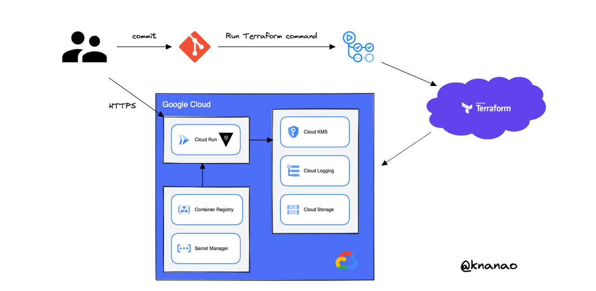

# tfcvlt
This is a demonstration to enable dynamic secrets with [Terraform Cloud](https://cloud.hashicorp.com/products/terraform) and [Vault OSS](https://www.vaultproject.io/) on [Cloud Run](https://cloud.google.com/run).

## Challenge
Terraform is widely used by a lot of developers to manage public cloud resources such as AWS, GCP and Azure.
And as you know, it is an important thing how to manage Terraform's state file when using it.
Many developers will store it in a cloud storage bucket to share it among develoers, and it makes CI/CD pipelines possible to run Terraform.
Furthermore, it is better for securiteis because not storing the state file on your local machine and in source control.

Ideally, you should avoid placing secrets in your Terraform config or state file wherever you stored it as long as possible,
because it is impossible to prevent the leaks completely, these might be due to human errors, vendor's incident or the other factors.
 
For even higher levels of security, every credentials used by Terraform should be short-lived, so that in case someone somehow gets access to the state file.
This prevents malicious users from using those to cause harm.

Vault is useful to enable the above, so let's solve these challenges by leveraging Terraform Cloud and Vault to provide a secure solution for using Dynamic Secret.

## Solution
Terraform asks Vault for service account's credentials rather than setting them as a variable.
And Vault requests Cloud providers to create a service account and handles its' secret with TTL.
This means these are automatically revoked when they are no longer used.

By making those credentials short-lived, you reduce the chance that they might be compromised.
If Terraform's state file was compromised, the credentials used by the terraform can be revoked rather than changing more global sets of credentials.

Moreover, Terraform will not output the secrets used for the Vault authentication into your state file.
This means Approle's role_id and secret_id are not exposed to and it's provided easily by using Terraform secure variable store.

## Prerequisites
To perform the next steps, you need to have:

* An HCP account or Terraform Cloud account to login Terraform Cloud.

* Install Vault on your local machine.

* Install Terraform on your local machine.

* An GCP account and GCP project.

* Install Google Cloud CLI(gcloud) to create and manage GCP resources.
